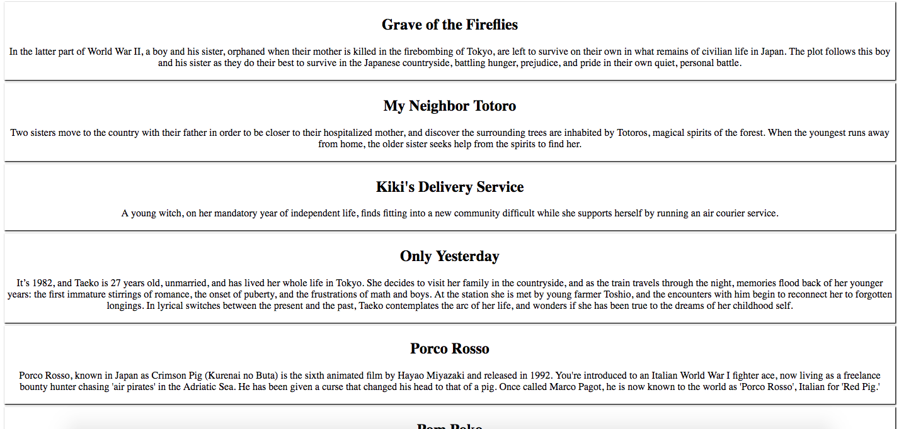

[](https://generalassemb.ly/education/web-development-immersive)

# API Practice

For this homework we want you to choose one of the following API's and render the requested information onto an HTML page in your browser.
<hr>

### - Don't forget to catch your errors
### - Remember to check ```response.data ```
### - If you're stuck remember that the data you need is going to be in an array, and you should store it in an array
### - Your main.js file and axios have both already been linked in the HTML
### - Remember to use the DOM to render the appropriate informattion


### Choose one:

Read the documentation of the rick and morty api to figure out the api endpoints and display the name and image of the main family of Rick and Morty on your HTML page. Don't forget there are objects inside of arrays, and remember how to access them.

# [Rick and Morty API](https://rickandmortyapi.com/)


> Hint: their ids start from 1 to 5
## Here is an example


---
Read the documentation of the studio ghibli api and display the title and description of their films on your HTML page. The endpoints of this page are listed on the left side of the website when you visit the link below, the actual api is the link below as well.

# [Studio Ghibli API](https://ghibliapi.herokuapp.com/)



